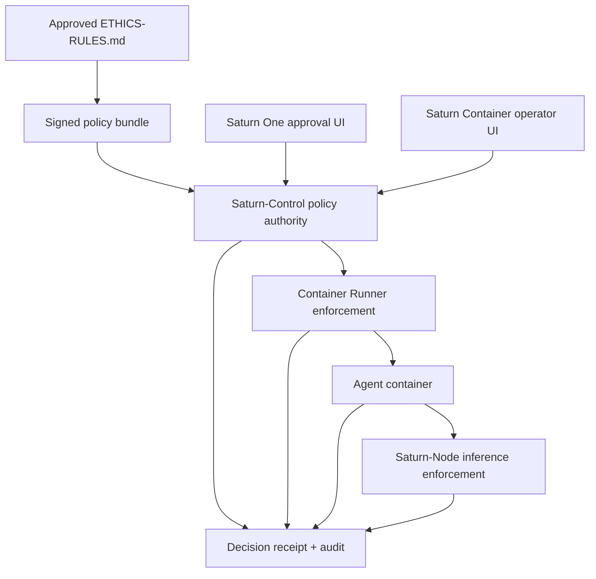

# EvoEthics Framework

**Status:** In development; not production-ready  
**Ethics source:** `docs/ETHICS-RULES.md` version `1.1-proposed`, pending founder approval

EvoEthics is the proposed deterministic ethics-policy subsystem of EvoIntelligenceFabric. It converts approved EvoCortexAI ethical constraints into inspectable decisions and obligations that Saturn components can enforce.

It is not a separate AI product, a moral-scoring model, or a mandatory remote cloud service.

## Purpose

The canonical ethical principles remain human-governed in `docs/ETHICS-RULES.md`. Product code needs a narrower machine contract for questions such as:

- May this agent deployment start?
- Does a lifecycle or tool action require exact approval?
- Is the requested compute scope bounded and interruptible?
- Is the image, model, network, data, and resource scope covered by policy?
- Must the operation be denied or escalated for human review?

EvoEthics answers from structured metadata. It must not receive raw prompts, document bodies, credentials, or generated content unless a future approved control proves that strictly necessary.

## Saturn architecture position



Saturn-Control runs and governs agent containers through its Container Runner. Saturn-Node supplies workload-authenticated MLX inference only. Frontends present intent and approval but cannot self-authorize.

The preferred evaluator remains embedded at trusted enforcement points. An optional local API adapter supports components that cannot import the library. Evaluation is local-first, deterministic, fail-closed for unknown actions, and independent of a cloud model.

## Naming

- Repository: `EvoCortexAI/evo-ethics-framework`
- Framework/subsystem: EvoEthics
- Swift module: `EvoEthics`
- Apple distributable, if needed later: `EvoEthics.xcframework`
- Optional local daemon: `evo-ethicsd`
- API namespace: `ai.evocortex.ethics.v1`

`Ethics.framework` is not the repository or subsystem name because `.framework` describes one Apple bundle and does not cover service or cross-language integrations.

## Decision contract

An evaluation produces:

1. `allow`
2. `allow_with_obligations`
3. `require_approval`
4. `require_review`
5. `deny`

A decision includes:

- policy version and digest;
- applicable ethical principle IDs;
- executable control IDs;
- required obligations;
- stable audit identifier;
- concise metadata-only explanation.

Principles are normative. Controls are testable implementation rules derived from them.

## Saturn MVP integration

The first integrated Saturn path is:

```text
Saturn One or Saturn Container
    -> Saturn-Control
    -> Container Runner
    -> Apple Container agent
    -> Saturn-Node
    -> saturn-mlx-mesh / MLX
```

Proposed first action IDs:

```text
agent.deploy
agent.start
agent.stop
agent.restart
inference.generate.local
```

Proposed baseline obligations:

- `local_execution`
- `metadata_audit`
- `content_logging_disabled`
- `interruptible`
- `bounded_resources`
- `workload_identity`
- `digest_pinned_image`

Enforcement:

- Saturn-Control evaluates before agent deployment, lifecycle mutation, compute assignment, and protected tool authorization.
- The Container Runner verifies the operation, deployment specification, and runtime obligations immediately before Apple Container side effects.
- Agent containers cannot lower their risk class, mint approvals, or reuse receipts for changed actions.
- Saturn-Node verifies workload identity, compute scope, limits, expiry, and applicable receipt before inference.
- Saturn One and Saturn Container present exact approval context but cannot convert a denial into permission.

Production enforcement remains blocked until:

- `ETHICS-RULES.md` is approved;
- action and control catalogs are reviewed;
- policy-bundle signing and downgrade resistance are defined;
- request and receipt schemas pass security review;
- rollback and evaluator failure behavior are tested;
- each enforcement point passes conformance and bypass tests.

## Repository contents

- `docs/ETHICS-RULES.md` - proposed canonical ethical source
- `docs/ARCHITECTURE.md` - policy architecture and trust boundaries
- `docs/INTEGRATION-MAP.md` - Saturn component enforcement points
- `docs/THREAT-MODEL.md` - threats and mitigations
- `spec/v1/` - JSON Schemas and OpenAPI contract
- `policy/` - development policy bundle and control catalog
- `Sources/EvoEthics/` - dependency-free Swift reference SDK
- `Sources/evo-ethicsctl/` - local evaluation CLI
- `conformance/` - engine-neutral test vectors

## Development quick start

Requirements: Swift 6.3 / Xcode 26 / macOS 26 on the organization self-hosted runner (`saturn-ci-apple-01` labels: `self-hosted`, `macOS`, `ARM64`, `apple-ci`, `xcode-26-6`). Python 3.11+.

```sh
swift test
python3 scripts/validate_specs.py
swift run evo-ethicsctl evaluate examples/container-delete.request.json
```

The reference evaluator demonstrates the contract and conformance behavior. It is not approved for production enforcement.

## Integration policy

- Evaluate before a protected side effect.
- Reject unknown, expired, mismatched, replayed, or unverifiable receipts.
- Bind approval to the exact actor, action, resource, image, model, execution target, limits, and expiry.
- Re-evaluate when any material fact changes.
- Never treat evaluator failure as permission.
- Keep raw prompts, files, credentials, and model output out of policy requests and ordinary audit events.
- Do not use a frontend approval state as the authoritative receipt.
- Do not treat an `allow` decision as authentication, authorization, sandboxing, or proof of a beneficial result.

## Current blockers

1. Founder approval of `ETHICS-RULES.md` version `1.1-proposed`.
2. Review of the agent-container and Saturn-Node action/control catalog.
3. Approval of the public license.
4. Confirmation that this repository is the canonical source, or definition of an explicit generated-mirror rule.
5. Security review of request, decision, policy-bundle, receipt, workload-identity, and audit schemas.
6. Conformance tests for Saturn-Control, Container Runner, agent workload, and Saturn-Node enforcement.
7. Confirmation of repository visibility and public-release readiness.

## Non-goals

- Using an LLM to decide whether an action is ethical.
- Sending user content to a central ethics service.
- Replacing authentication, authorization, sandboxing, workload identity, or OS controls.
- Treating an `allow` decision as proof that an outcome is beneficial.
- Encoding human welfare as an opaque runtime score.
- Blocking basic local inference on an external network call.
- Letting an agent or frontend self-declare its risk class.

See `docs/ROADMAP.md` and Saturn-Control's `docs/SATURN-MVP.md`.
