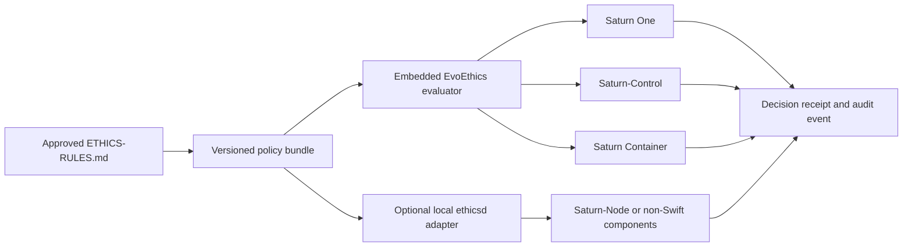

# EvoEthics Framework

**Status:** In development. Repository proposal; not production-ready.  
**Ethics source:** `docs/ETHICS-RULES.md` version `1.1-proposed`, pending founder approval.

EvoEthics is the proposed ethics-policy subsystem of **EvoIntelligenceFabric**. It converts approved EvoCortexAI ethical constraints into deterministic, inspectable policy decisions that Saturn components can enforce.

It is not a separate AI product, a moral-scoring model, or a remote service that must be reachable for local operation.

## Why this exists

The canonical ethical principles remain human-governed in `docs/ETHICS-RULES.md`. Product code needs a narrower machine contract for questions such as:

- May this operation leave the user-controlled boundary?
- Is explicit approval required before execution?
- Is the proposed agentic scope bounded and interruptible?
- Is the action registered, auditable, and covered by the active policy bundle?
- Must the operation be denied or escalated for human review?

EvoEthics answers those questions from structured metadata. It must not receive raw prompts, document bodies, credentials, or other user content unless a future approved control makes that strictly necessary.

## Architectural position



The preferred path is an **embedded evaluator**. An optional local API adapter exists for components that cannot import the library. Policy evaluation must remain local-first, deterministic, fail-closed for unknown actions, and available without an external cloud dependency.

## Naming

- Repository: `EvoCortexAI/evo-ethics-framework`
- Framework/subsystem: **EvoEthics**
- Swift module: `EvoEthics`
- Apple distributable, if needed later: `EvoEthics.xcframework`
- Optional local daemon: `evo-ethicsd`
- API namespace: `ai.evocortex.ethics.v1`

`Ethics.framework` is not recommended as the repository or subsystem name because `.framework` specifically describes an Apple bundle and would not cover Saturn-Node or service integrations.

## Decision contract

An evaluation produces one of five outcomes:

1. `allow`
2. `allow_with_obligations`
3. `require_approval`
4. `require_review`
5. `deny`

A decision includes:

- policy version and digest
- applicable ethical principle IDs (`E1`-`E10`)
- executable control IDs (`EC-*`)
- required obligations
- a stable audit identifier
- a concise explanation that does not contain raw user content

Ethical principle IDs and executable control IDs are intentionally separate. Principles are normative. Controls are testable implementation rules derived from those principles.

## Saturn MVP integration boundary

EvoEthics does **not** block the first Saturn local-inference proof:

```text
Saturn One -> Saturn-Control -> Saturn-Node -> local MLX model
```

The initial vertical slice must preserve the intended ethical architecture through explicit product and API constraints even before production policy enforcement is enabled:

- local/private execution is the default route;
- the selected model, node, execution location, timing, and outcome are visible;
- generation is interruptible and cancellation is propagated;
- failures are attributable to a component and request ID;
- standard logs exclude prompt and generated-response bodies;
- successful chat generation does not authorize tools, file changes, infrastructure actions, or other side effects.

After the local-inference acceptance gate passes, the first proposed policy action is:

```text
inference.chat.local
```

Proposed obligations:

- `local_execution`
- `metadata_audit`
- `content_logging_disabled`
- `interruptible`

The evaluation request should use operational metadata only. It must not include the prompt, conversation text, generated content, credentials, or private document bodies.

Production enforcement remains blocked until:

- `ETHICS-RULES.md` is approved;
- the action and control catalog is reviewed;
- policy-bundle signing and downgrade resistance are defined;
- request and receipt schemas pass security review;
- rollback behavior and evaluator failure semantics are tested;
- component integrations pass conformance tests.

This staging prevents an unfinished governance subsystem from becoming a fragile remote dependency while preserving a clear route to enforceable policy.

## Repository contents

- `docs/ETHICS-RULES.md` - proposed canonical ethical source
- `docs/ARCHITECTURE.md` - policy architecture and trust boundaries
- `docs/INTEGRATION-MAP.md` - Saturn component integration points
- `docs/THREAT-MODEL.md` - primary threats and required mitigations
- `spec/v1/` - JSON Schemas and OpenAPI contract
- `policy/` - development policy bundle and control catalog
- `Sources/EvoEthics/` - dependency-free Swift reference SDK
- `Sources/evo-ethicsctl/` - local evaluation CLI
- `conformance/` - engine-neutral test vectors

## Development quick start

Requirements: Swift 6 and Python 3.11+.

```sh
swift test
python3 scripts/validate_specs.py
swift run evo-ethicsctl evaluate examples/container-delete.request.json
```

The reference evaluator is intentionally small. It demonstrates the contract and conformance behavior; it is not yet approved for production enforcement.

## Integration policy

- Product components must call the evaluator **before** a sensitive side effect.
- Executors must reject unknown, expired, mismatched, or unverifiable decision receipts.
- A UI approval is not sufficient unless it is cryptographically or transactionally bound to the exact requested operation.
- Evaluation failures must not silently become permission.
- Policy updates must be versioned, validated, signed before production use, and rolled out with an explicit rollback path.
- Basic local chat remains a read/generate path; tool execution and external side effects require separately registered actions and controls.

## Current blockers before public release

1. Founder approval of `ETHICS-RULES.md` version `1.1-proposed`.
2. Canonical naming decision for **Saturn Container** in the company document set.
3. Approval of the public license. The recommended model is Apache-2.0 for code and CC BY 4.0 for normative documentation and specifications.
4. Selection of this repository as the canonical approved source, or an explicit generated-mirror rule if another repository remains canonical.
5. Security review of the request, decision, policy-bundle, receipt, and audit schemas.
6. Confirmation of repository visibility and public-release readiness; repository existence alone does not authorize publication.

## Non-goals

- Using an LLM to decide whether an action is ethical.
- Sending user content to a central ethics service.
- Replacing product authorization, authentication, sandboxing, or OS controls.
- Treating an `allow` decision as proof that an outcome is beneficial.
- Encoding abstract concepts such as Human Flourishing as an opaque runtime score.
- Blocking local inference on a network call to EvoEthics.

See `docs/ROADMAP.md` for the proposed release sequence and the Saturn-Control `docs/SATURN-MVP.md` plan for MVP staging.
