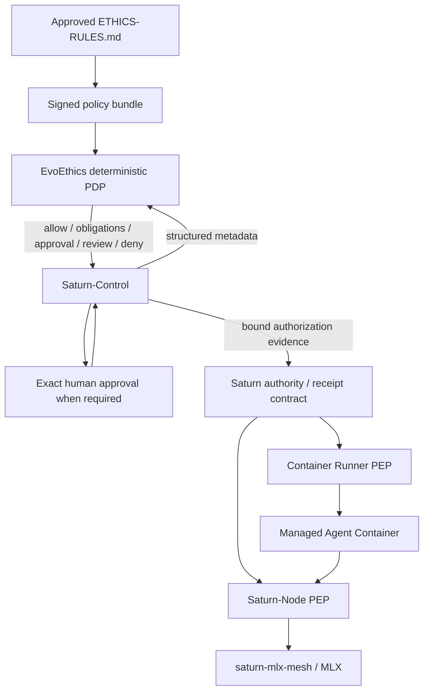
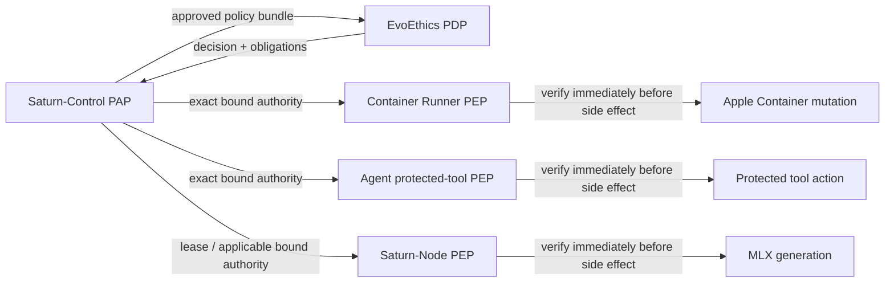
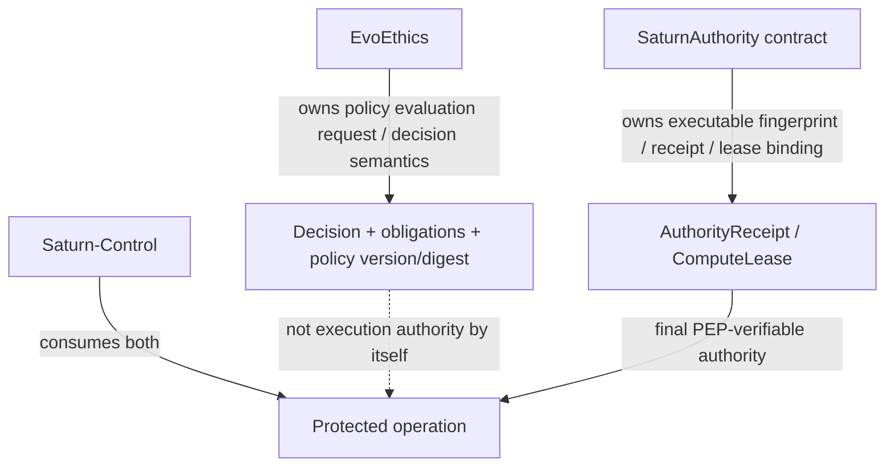
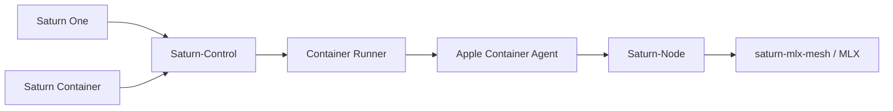

# EvoEthics Framework

**Status:** In development; not production-ready  
**Ethics source:** `docs/ETHICS-RULES.md` version **1.1** (approved 2026-08-21).  
A proposed 1.2 amendment (E11 Human Privacy) is under review and is **not** authoritative until approved and merged.

> **Public source status:** This repository may be publicly inspected under the proprietary [`LICENSE`](LICENSE). Public visibility does **not** make it open source. External contributions are currently **closed**; see [`.github/CONTRIBUTING.md`](.github/CONTRIBUTING.md) and [`LICENSING.md`](LICENSING.md).

EvoEthics is the proposed deterministic ethics-policy subsystem of EvoIntelligenceFabric. It converts approved EvoCortexAI ethical constraints into inspectable decisions and obligations that Saturn components can enforce.

It is not a separate AI product, a moral-scoring model, or a mandatory remote cloud service.

## Purpose

The canonical ethical principles remain human-governed in `docs/ETHICS-RULES.md`. Product code needs a narrower machine contract for questions such as:

- May this agent deployment start?
- Does a lifecycle or tool action require exact approval?
- Is the requested compute scope bounded and interruptible?
- Is the image, model, network, data, and resource scope covered by policy?
- Must the operation be denied or escalated for human review?

EvoEthics answers from structured metadata. It must not receive raw prompts, document bodies, credentials, or generated content unless a future approved control proves that strictly necessary.

## Saturn architecture position



EvoEthics supplies deterministic governance decisions and obligations. It does **not** itself replace Saturn authentication, authorization, approval capture, workload identity, cryptographic authority binding, sandboxing, or final-side-effect enforcement.

## PAP / PDP / PEP separation



Unknown, expired, mismatched, replayed, revoked, or policy-downgraded authority must fail closed at the final enforcement point.

## Ownership boundary



EvoEthics owns policy-evaluation semantics, policy version/digest, principle/control IDs, controls, and obligations. The canonical Saturn authority package owns the executable fingerprint, receipt envelope, compute-lease binding, cryptographic seal metadata, expiry/replay semantics, and verifier compatibility.

## Naming

- Repository: `EvoCortexAI/evo-ethics-framework`
- Framework/subsystem: EvoEthics
- Swift module: `EvoEthics`
- Apple distributable, if needed later: `EvoEthics.xcframework`
- Optional local daemon: `evo-ethicsd`
- API namespace: `ai.evocortex.ethics.v1`

## Decision contract

An evaluation produces:

1. `allow`
2. `allow_with_obligations`
3. `require_approval`
4. `require_review`
5. `deny`

A decision includes policy version/digest, applicable ethical principle IDs, executable control IDs, required obligations, a stable audit identifier, and a concise metadata-only explanation.

Principles are normative. Controls are testable implementation rules derived from them.

## Saturn MVP integration



Proposed first action IDs:

```text
agent.deploy
agent.start
agent.stop
agent.restart
inference.generate.local
```

Proposed baseline obligations include `local_execution`, `metadata_audit`, `content_logging_disabled`, `interruptible`, `bounded_resources`, `workload_identity`, and `digest_pinned_image`.

Production enforcement remains blocked until the ethical source, action/control catalogs, signed policy-bundle and downgrade resistance, authority/receipt binding, security review, rollback behavior, and enforcement-point conformance are approved and proven.

## Repository contents

- `docs/ETHICS-RULES.md` — canonical ethical source (approved version on `main`)
- `docs/ARCHITECTURE.md` — policy architecture and trust boundaries
- `docs/INTEGRATION-MAP.md` — Saturn component enforcement points
- `docs/THREAT-MODEL.md` — threats and mitigations
- `docs/PUBLIC-RELEASE-CHECKLIST.md` — Phase A/Phase B enrollment gates
- `.github/CONTRIBUTING.md` — current contribution status
- `spec/v1/` — JSON Schemas and OpenAPI contract
- `policy/` — development policy bundle and control catalog
- `Sources/EvoEthics/` — dependency-free Swift reference SDK
- `Sources/evo-ethicsctl/` — local evaluation CLI
- `conformance/` — engine-neutral test vectors

## Development quick start

Requirements: Swift 6.3 / Xcode 26 / macOS 26.

```sh
swift test
swift run evo-ethicsctl evaluate examples/container-delete.request.json
```

`swift test` performs repository validation for the JSON Schemas, policy bundle, control catalog, examples, OpenAPI guardrails, ethics-heading drift, and conformance vectors in addition to the evaluator unit tests.

Trusted CI runs on organization-managed Apple infrastructure. Public/untrusted pull requests are intentionally not dispatched to private self-hosted runners while external contributions are closed.

The reference evaluator demonstrates the contract and conformance behavior. It is not approved for production enforcement.

## Integration policy

- Evaluate before a protected side effect.
- Reject unknown, expired, mismatched, replayed, revoked, or unverifiable authority.
- Bind approval to the exact actor, action, resource, image, model, execution target, limits, and expiry through the canonical Saturn authority contract.
- Re-evaluate when any material fact changes.
- Never treat evaluator failure as permission.
- Keep raw prompts, files, credentials, and model output out of policy requests and ordinary audit events.
- Do not use a frontend approval state as authoritative execution authority.
- Do not treat an `allow` decision as authentication, authorization, sandboxing, or proof of a beneficial result.

## Current repository license

EvoCortexAI-owned material in this repository is currently governed by the proprietary [`LICENSE`](LICENSE), regardless of repository visibility. Public visibility is for transparency, inspection, and evaluation and does not make the repository open source or invite external contributions.

A future Apache-2.0 / CC-BY-4.0 model is documented in [`LICENSING.md`](LICENSING.md), including explicit treatment of JSON Schema, OpenAPI, conformance vectors, policy bundles, normative prose, and trademarks. That future model is not active until separately approved and committed.

## Residual blockers for open-source/contribution enrollment

1. Founder + legal approval of the final outbound licensing model.
2. Final license texts, SPDX/file-level boundary, and third-party notices.
3. Inbound contribution terms (DCO/CLA decision).
4. Public-safe CI for untrusted external contributions.
5. Contributor governance and review rules.
6. Completion of the Phase B gates in `docs/PUBLIC-RELEASE-CHECKLIST.md`.

Until those are closed, external contributions remain disabled by policy and the project remains `In development; not production-ready`.

## Non-goals

- Using an LLM to decide whether an action is ethical.
- Sending user content to a central ethics service.
- Replacing authentication, authorization, sandboxing, workload identity, or OS controls.
- Treating an `allow` decision as proof that an outcome is beneficial.
- Encoding human welfare as an opaque runtime score.
- Blocking basic local inference on an external network call.
- Letting an agent or frontend self-declare its risk class.

See `docs/ROADMAP.md` and Saturn-Control's `docs/SATURN-MVP.md`.
